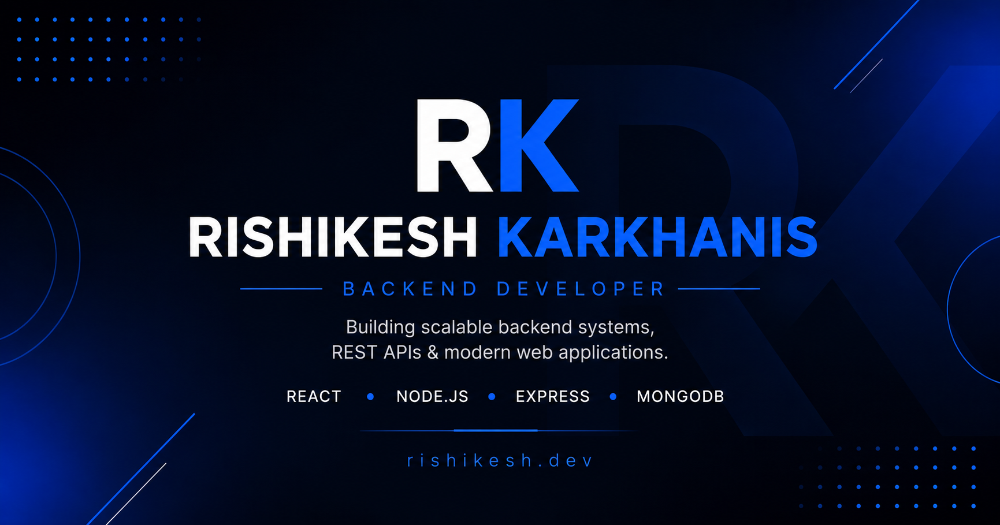

<div align="center">

# 👋 Hi, I'm Rishikesh Karkhanis

### Backend Developer • AI/ML Engineering Student

Building scalable backend systems, modern web applications, and solving real-world problems through clean software engineering.

🌐 **Live Portfolio:** https://rishikesh-karkhanis-portfolio.vercel.app

</div>

---

## 📖 About

This repository contains the source code for my personal portfolio website, designed to showcase my projects, technical skills, professional experience, and achievements.

The portfolio is built with a clean and modern UI, focusing on performance, responsiveness, and accessibility while maintaining a professional aesthetic.

---

## ✨ Features

- 🎨 Modern & Minimal UI
- 📱 Fully Responsive Design
- ⚡ Smooth Animations with Framer Motion
- 📊 Scroll Progress Indicator
- 📌 Active Navigation
- 📂 Featured Projects Showcase
- 📄 Resume Download
- 📬 Contact Section
- 🔍 SEO Optimized
- 🚀 Deployed on Vercel

---

## 🛠 Tech Stack

### Frontend

- React.js
- Vite
- Tailwind CSS
- Framer Motion

### UI Libraries

- Lucide React
- React Icons

### Deployment

- Vercel

---

## 📂 Project Structure

```text
src
│
├── assets
├── components
│   ├── animations
│   ├── cards
│   ├── layout
│   ├── sections
│   └── ui
│
├── constants
├── hooks
├── utils
│
├── App.jsx
└── main.jsx

public
│
├── favicon.png
├── og-image.png
├── robots.txt
├── sitemap.xml
└── resume.pdf
```

---

## 🚀 Getting Started

### Clone the repository

```bash
git clone https://github.com/YOUR_USERNAME/rishikesh-karkhanis-portfolio.git
```

### Navigate to the project

```bash
cd rishikesh-karkhanis-portfolio
```

### Install dependencies

```bash
npm install
```

### Start development server

```bash
npm run dev
```

### Build for production

```bash
npm run build
```

---

## 📸 Preview



---

## 📬 Connect With Me

- 🌐 Portfolio: https://rishikesh-karkhanis-portfolio.vercel.app
- 💼 LinkedIn: https://linkedin.com/in/rishikeshkarkhanis01
- 💻 GitHub: https://github.com/RishikeshKarkhanis
- 📧 Email: rishikeshkarkhanis0101@gmail.com

---

<div align="center">

### ⭐ If you like this project, consider giving it a star!

Made with ❤️ by **Rishikesh Karkhanis**

</div>